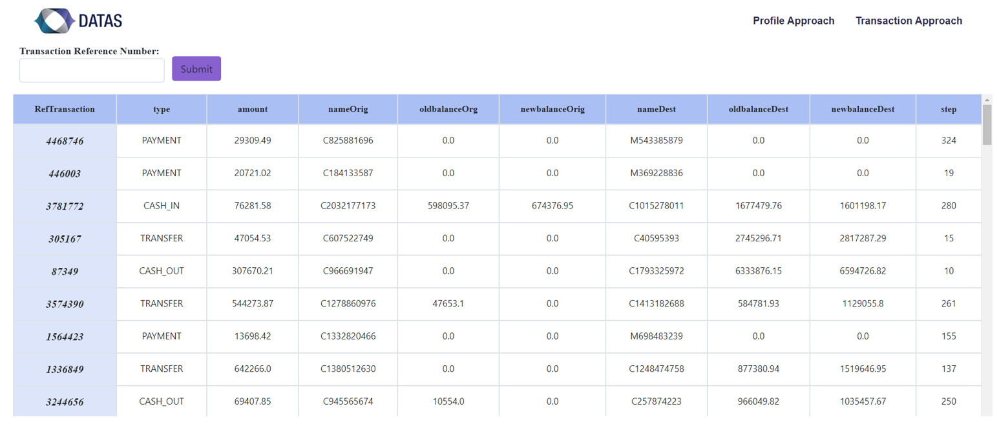
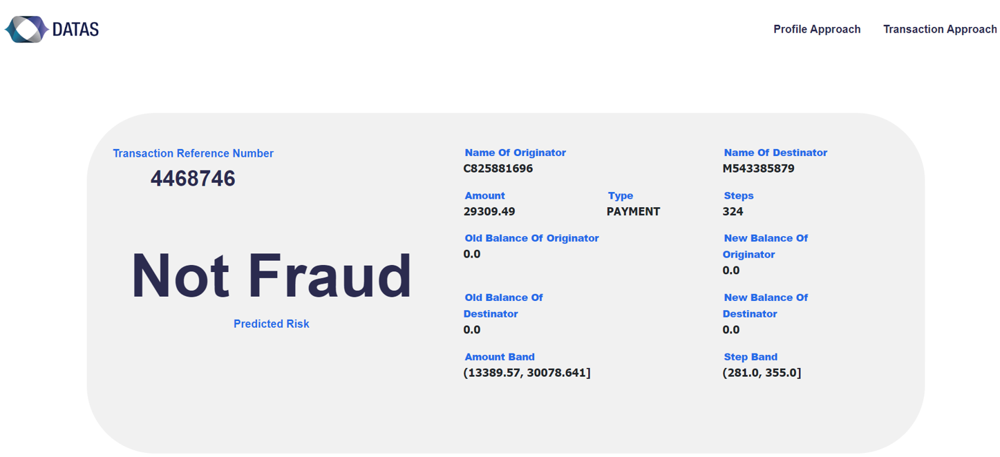

# Fraudulent-transaction-prediction-model

This is the second approach of our solution, which is to create a machine learning model that predicts whether a transaction is fraudulent without relying on any information about the customer's activity.

We proceeded to code and scale the variables to make them understandable by the algorithms.
The next step allowed us to generate new features with better predictive power. 
Next, we balanced the target classes by applying subsampling and oversampling techniques.
The next step was to train the model, select features and optimize the parameters to improve the model performance.
Finally, the comparison of the results of the linear curves and the final cross-validation score, highlighted the fact that the 'XGBoost' model recorded the highest score.
Thus, the score obtained is around 0.98 which confirms the performance of the model and confirms us in the predictions of fraudulent transactions. Nevertheless, and considering the sensitivity of the fraud problem and its heavy impacts, we consider that it is important to further refine our work by enriching the data to be used. 

Finally, the model was exported using the Joblib library and was deployed in our web application that we built using Djang.

